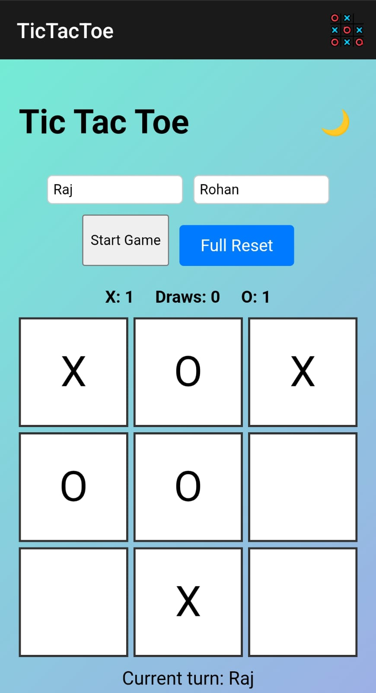

# Tic Tac Toe Game

A simple web-based Tic Tac Toe game built using HTML, CSS, and JavaScript.  
This project was also converted into an Android mobile app.

---

## 🎮 Live Demo

👉 [Play Now](https://rajdeepsingh2.github.io/tic-tac-toe-game/)

---
## 📸 Screenshot

---
## 📱 Mobile App

This project was converted into an Android app. 
You can install it and play offline on your phone.
## 📲 Download the Android App

👉 [Download APK](https://drive.google.com/file/d/1hTxSyPswJViNi2tlNdGYgUeLk7pqupXq/view?usp=drive_link)
---

## 📁 Files

- `index.html` — main structure  
- `style.css` — styles and layout  
- `script.js` — game logic

---

## 💡 Features

- 🎮 **Player vs Player Mode** – Take turns and battle it out with a friend.
- 📱 **Mobile Responsive UI** – Smooth layout that adapts beautifully on phones, tablets, and laptops.
- 🌈 **Gradient Background** – Visually appealing design with soft gradient styling.
- ♻️ **Reset Scoreboard** – Easily reset game stats and start fresh.
- 🌙 **Light/Dark Theme Toggle** – Switch themes with a single click for day or night play.
- 🔊 **Move Sound Effects** – Hear a sound on each move for a more interactive experience.
- 🗣️ **Voice Result Announcement** – Winner's name is spoken aloud when the game ends.

---

